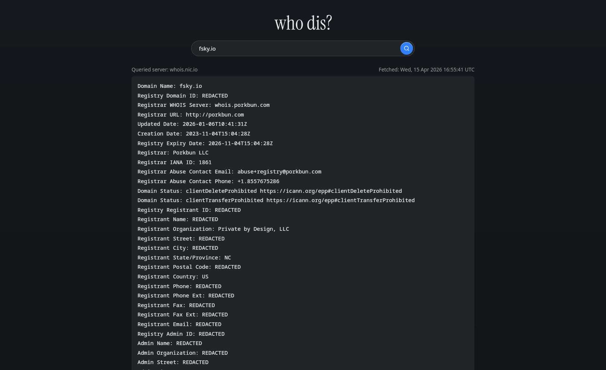

# who dis?

A lightweight, self-hosted RDAP and WHOIS lookup tool with a clean web
interface. Query domain names, TLDs, IP addresses, CIDR ranges, ASNs, and
tagged entity handles from your browser.

The default Auto mode tries RDAP first and falls back to WHOIS when RDAP is
unavailable. RDAP responses are rendered as complete, syntax-highlighted JSON
on the server, with the exact upstream body available in a collapsed raw view;
the application does not require browser JavaScript.



## Deploying

### Container (recommended)

```sh
docker run -p 8080:8080 foundry.fsky.io/fsky/whodis:latest
```

A [Quadlet](https://docs.podman.io/en/latest/markdown/podman-systemd.unit.5.html) unit file is available at [`contrib/quadlet/whodis.container`](contrib/quadlet/whodis.container) for deploying with Podman and systemd.

### From source

Requires Go 1.26+.

```sh
go build ./cmd/whodis
./whodis
```

Then open http://localhost:8080 in your browser.

## Go packages

The protocol clients are importable without pulling the web application into
your program:

```go
import "foundry.fsky.io/fsky/whodis/whois"

client := whois.NewClient()
result, err := client.Lookup(ctx, "example.com")
```

RDAP exposes the same raw-response style of API:

```go
import "foundry.fsky.io/fsky/whodis/rdap"

client := rdap.NewClient()
result, err := client.Lookup(ctx, "example.com")
response, err := client.Query(ctx, "https://rdap.example/rdap/domain/example.com")
```

The repository remains one Go module, so its downloaded source archive also
contains the web app, but importing `whois` or `rdap` neither compiles nor
initializes the application package.

`Lookup` chooses an appropriate server and follows recognized referrals.
`Query` sends an exact, single-line query to a caller-selected `whois.Endpoint`.
Responses are returned as raw bytes together with the endpoint, exact wire
query, and referral metadata; interpreting registry records is left to the
caller.

When a later referral fails, `Lookup` returns the completed responses together
with the error. Errors support `errors.Is` and `errors.As`, including typed
operation errors and registry web URLs for resources without WHOIS service.

Automatic lookups only contact public WHOIS/RWhois endpoints by default.
Direct queries permit caller-selected private endpoints, and both policies can
be replaced with client options.

RDAP `Lookup` discovers the service from the checked-in IANA bootstrap data,
tries advertised alternatives, follows safe redirects, and validates successful
responses as JSON. `Query` fetches an exact caller-selected HTTP(S) URL. It
permits private endpoints by default, while automatic lookups only contact
public addresses and pin validated DNS results when dialing.

Both routing snapshots are compiled into the packages. Normal builds and tests
perform no bootstrap downloads. Maintainers can refresh the checked-in data
from the public registries with:

```sh
make refresh-data
```

Use `make refresh-whois` or `make refresh-rdap` to refresh only one snapshot.

## Development

The root Makefile provides the common workflows:

```sh
make                 # build ./whodis (the default target)
make run             # run from source
make check           # formatting check, go vet, and tests; fully offline
make test-race       # run tests with the race detector
make fmt             # format Go source in place
make container       # build whodis:dev with Docker (overridable)
make help            # list every target
```

Variables can be overridden on the command line, for example
`make BINARY=whodis-dev build` or
`make CONTAINER_ENGINE=podman IMAGE=localhost/whodis:dev container`.

## Configuration

Configuration is handled through environment variables:

| Variable                | Default | Description                                                                 |
| ----------------------- | ------- | --------------------------------------------------------------------------- |
| `PORT`                  | `8080`  | TCP port the HTTP server listens on                                         |
| `CACHE_TTL`             | `24h`   | Cache duration for successful lookups. Accepts Go duration strings (`1h`, `30m`, etc.) |
| `RATE_LIMIT_PER_MINUTE` | `20`    | Per-IP rate limit applied only to cache misses. Set to `0` to disable.      |
| `RATE_LIMIT_BURST`      | `10`    | Maximum burst of cache-miss lookups a single IP can make before throttling. |
| `TRUST_PROXY_HEADERS`   | `false` | When `true`, honor `X-Forwarded-For` / `X-Real-IP` for client IP. Only enable when whodis is behind a trusted reverse proxy. |

Error results are cached for 5 minutes regardless of `CACHE_TTL`. Rate limiting only applies to cache misses. Popular lookups served from cache are never throttled.

## License

The code of this project is released under the [Zero-Clause BSD License](https://opensource.org/license/0bsd/). See the `LICENSE` file for details.
